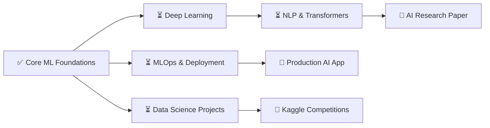

<!-- ╔══════════════════════════════════════════════════════════════════╗ -->
<!-- ║               MARUF SHIAB — GITHUB PROFILE README               ║ -->
<!-- ╚══════════════════════════════════════════════════════════════════╝ -->

<div align="center">


<br/>

<p>
  
  
</p>

<p>
  
  
  
</p>


</div>

<br/>

<!-- ═══════════════════ ABOUT ME ═══════════════════ -->

```python
class MarufShiab:
    def __init__(self):
        self.name        = "Maruf Shiab"
        self.role        = "AI/ML Enthusiast & Research Learner"
        self.location    = "Dhaka, Bangladesh 🇧🇩"
        self.education   = "3rd Year CSE Student"

        self.interests   = [
            "Artificial Intelligence 🤖",
            "Machine Learning 📊",
            "Deep Learning 🧠",
            "Research & Innovation 🔬",
        ]

        self.currently   = {
            "learning"  : ["PyTorch", "Transformers", "MLOps"],
            "building"  : "AI-powered real-world projects",
            "exploring" : "Research opportunities in AI",
        }

        self.fun_fact    = "I believe data has a story — I just help it speak! 📖"

    def say_hi(self):
        print("Thanks for dropping by! Let's build something amazing 🚀")
```

<div align="center">

</div>

<br/>

<!-- ═══════════════════ CONNECT ═══════════════════ -->

## 🌐 Connect with Me

<p align="left">
  <a href="https://www.facebook.com/maruf.shiab" target="_blank">
    
  </a>
  <a href="https://instagram.com/maruf_shiab_" target="_blank">
    
  </a>
  <a href="mailto:your-email@example.com">
    
  </a>
</p>

<div align="center">

</div>

<br/>

<!-- ═══════════════════ TECH STACK ═══════════════════ -->

<div align="center">

## ⚡ Tech Stack & Expertise

</div>

<br/>

<div align="center">

### 「 💻 Programming Languages 」

<a href="https://skillicons.dev">
  
</a>

</div>

<br/>

<div align="center">

### 「 🧠 AI / ML / Data Science 」

<a href="https://skillicons.dev">
  
</a>

<br/>


</div>

<br/>

<div align="center">

### 「 🌐 Web & App Development 」

<a href="https://skillicons.dev">
  
</a>

</div>

<br/>

<div align="center">

### 「 ☁️ Cloud, DevOps & Tools 」

<a href="https://skillicons.dev">
  
</a>

</div>

<br/>

<div align="center">

### 「 🗄️ Databases 」

<a href="https://skillicons.dev">
  
</a>

</div>

<br/>

<div align="center">

### 「 📊 Proficiency Levels 」

| 🏷️ Category | 🛠️ Technologies | 📈 Level |
|:---:|:---|:---:|
| **AI / ML** | TensorFlow · PyTorch · scikit-learn · Keras |  |
| **Languages** | Python · C++ · Java · JavaScript |  |
| **Web Dev** | Node.js · Next.js · FastAPI · Laravel |  |
| **Databases** | MySQL · PostgreSQL · MongoDB |  |
| **Cloud** | AWS · GCP · Firebase |  |
| **Data Science** | NumPy · Pandas · Matplotlib · Plotly |  |

<br/>

<p>
  
  
  
</p>


</div>

<br/>

<!-- ═══════════════════ FEATURED PROJECTS ═══════════════════ -->

## 🚀 Featured Projects

<div align="center">

</div>

<table align="center" border="0" cellpadding="20">
<tr>
<td width="50%" valign="top">

<div align="center">
  
  <br/><br/>
  
</div>

<br/>

> 🧠 **Your best machine learning or deep learning project** — add description here

<table>
<tr><td>🔬</td><td>Research-driven approach</td></tr>
<tr><td>📊</td><td>Real-world dataset</td></tr>
<tr><td>🎯</td><td>Practical impact</td></tr>
<tr><td>📈</td><td>Measurable results</td></tr>
</table>

<div align="center">
  <a href="#"></a>
</div>

</td>
<td width="50%" valign="top">

<div align="center">
  
  <br/><br/>
  
</div>

<br/>

> 📄 **Your research or academic project** — add description and findings here

<table>
<tr><td>📝</td><td>Academic rigor</td></tr>
<tr><td>🔍</td><td>Novel insights</td></tr>
<tr><td>📊</td><td>Data analysis</td></tr>
<tr><td>🌍</td><td>Real-world relevance</td></tr>
</table>

<div align="center">
  <a href="#"></a>
</div>

</td>
</tr>

<tr><td colspan="2"></td></tr>

<tr>
<td width="50%" valign="top">

<div align="center">
  
  <br/><br/>
  
</div>

<br/>

> 🌐 **Your strongest web or app project** — add description here

<table>
<tr><td>⚡</td><td>Fast & responsive UI</td></tr>
<tr><td>🔐</td><td>Secure architecture</td></tr>
<tr><td>🚀</td><td>Production deployed</td></tr>
<tr><td>👥</td><td>User-centric design</td></tr>
</table>

<div align="center">
  <a href="#"></a>
</div>

</td>
<td width="50%" valign="top">

<div align="center">
  
  <br/><br/>
  
</div>

<br/>

> 📊 **Your data science or analysis project** — add description here

<table>
<tr><td>📈</td><td>Statistical analysis</td></tr>
<tr><td>🔮</td><td>Predictive modeling</td></tr>
<tr><td>🎨</td><td>Rich visualizations</td></tr>
<tr><td>💡</td><td>Actionable insights</td></tr>
</table>

<div align="center">
  <a href="#"></a>
</div>

</td>
</tr>
</table>

<div align="center">

</div>

<br/>

<!-- ═══════════════════ GITHUB ANALYTICS ═══════════════════ -->

## 📊 GitHub Analytics

<div align="center">


<br/>


<br/>


</div>

<details>
<summary>📈 More Stats (Click to Expand)</summary>
<br/>
<div align="center">


</div>
</details>

<br/>

<!-- ═══════════════════ 3D CONTRIBUTIONS ═══════════════════ -->

## 🌍 Global Contribution Insights

<div align="center">
  
</div>

<div align="center">

</div>

<br/>

<!-- ═══════════════════ ROADMAP ═══════════════════ -->

## 🎯 Current Goals & Roadmap



### 🔥 In Progress
- 🧠 Deep diving into **Deep Learning** architectures (CNNs, RNNs, Transformers)
- 🔬 Exploring **research opportunities** in AI/ML
- 📊 Building hands-on **data science projects** for portfolio
- 🚀 Learning **MLOps** — model deployment and monitoring

### ✅ Recently Completed
- 📚 Strengthened foundations in **Python, NumPy, Pandas, Matplotlib**
- 🤖 Explored **scikit-learn** for classical ML algorithms
- 🎨 Enhanced GitHub profile with analytics & dynamic widgets
- 💻 Expanded tech stack to **50+ technologies**

### ✨ Upcoming
- 📄 Contribute to an **open-source AI/ML project**
- 🏆 Compete in **Kaggle** challenges
- 📝 Write **technical blogs** sharing ML learnings
- 🎓 Pursue **AI research internship** opportunities

---

## 🏆 Highlights

```
🧠 AI/ML Enthusiast        🔬 Research Oriented
🎓 3rd Year CSE            💡 Problem Solver
📊 Data-Driven Thinker     🚀 Fast Learner
🌍 Open Source Advocate    ☕ Coffee-Powered Coder
```

---

## 💭 Dev Quote of the Day

<div align="center">


</div>

---

## 🤝 Let's Connect!

<div align="center">

[](https://www.facebook.com/maruf.shiab)
[](https://instagram.com/maruf_shiab_)
[](mailto:your-email@example.com)

<br/>

### 💬 *"In God we trust; all others must bring data."* — W. Edwards Deming

---

⭐️ **If you find my work interesting, drop a star on my repositories!**

**Made with ❤️, lots of ☕, and endless curiosity about AI**

<br/>

<p>
  
  
</p>

</div>


